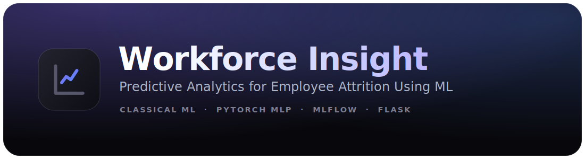

<div align="center">
  
  <h4>Classical ML + Deep Learning (PyTorch) · MLflow tracking · Flask API · DVC · CI</h4>

  <p><a href="https://github.com/Txxjasss/Workforce-Insight">github.com/Txxjasss/Workforce-Insight</a></p>

  <p>
    
    
    
    
    
    
    
  </p>
</div>

---

## 📌 Overview

Predicts whether an employee is at risk of leaving, and — more usefully — **why**.
A trained model is served behind a Flask API and a small web UI that returns a
risk probability *plus* a per-factor explanation (which inputs push the risk up
or down vs. a baseline employee) and concrete retention recommendations.

The project benchmarks **classical ML against a deep neural network**, tracks
every experiment with **MLflow**, versions data with **DVC**, ships tests, a
**Dockerfile**, and a **GitHub Actions CI** pipeline — the full path from raw CSV
to a reproducible, deployable service.

> Dataset: IBM HR Analytics Employee Attrition — 1,470 employees, 35 raw columns,
> ~16% attrition (a ~5:1 class imbalance that the modelling explicitly handles).

---

## 🏆 Results

Five candidate models are compared with 5-fold cross-validation, then re-evaluated
on a held-out 20% test set. Models are compared on **ROC AUC** (robust under class
imbalance — accuracy is misleading when 84% of employees stay), and the **served
model is selected by F1** to reward actually catching leavers, not raw accuracy.

**5-fold cross-validation (ROC AUC, train split):**

| Model                       | CV ROC AUC        |
| --------------------------- | ----------------- |
| Logistic Regression         | 0.762 ± 0.027     |
| Random Forest               | 0.801 ± 0.028     |
| Gradient Boosting           | 0.809 ± 0.017     |
| **MLP (PyTorch, deep net)** | **0.817 ± 0.036** |

**Held-out test set (final models):**

| Model              | Accuracy | Precision | Recall   | F1       | ROC AUC   |
| ------------------ | -------- | --------- | -------- | -------- | --------- |
| Random Forest      | 0.844    | 0.571     | 0.085    | 0.148    | **0.778** |
| **MLP (PyTorch)** ⭐ | 0.772    | 0.381     | **0.681**| **0.489**| 0.774     |

> ⭐ **Served model**, selected by F1. Best per column is bolded.

**Why this is interesting (and a good talking point):** the two models are
neck-and-neck on ROC AUC, but they make very different trade-offs. The class-
balanced **MLP catches ~68% of employees who actually leave** (recall) versus
~8% for the tuned Random Forest. For a retention use case — where missing an
at-risk employee is the costly error — recall matters more than raw accuracy,
so the deep model is the better business choice despite similar AUC.
`train.py` selects the winner by **F1** (`SELECTION_METRIC` in `train.py`), so the
**MLP is the model that gets served** — switching the criterion is a one-line change.

---

## 🧠 ML / DL Workflow

1. **Load & EDA** — class balance, attrition rates by OverTime / BusinessTravel / JobRole.
2. **Feature engineering** — drop constant/ID columns, label-encode binaries,
   one-hot encode categoricals → a fixed **49-feature** schema shared by training
   and serving (validated at both ends).
3. **Model comparison** — Logistic Regression, Random Forest, Gradient Boosting,
   and a **PyTorch MLP** under identical 5-fold CV.
4. **Tuning / training** — `GridSearchCV` over the Random Forest; the MLP trained
   with standardization, class-weighted `BCEWithLogitsLoss`, BatchNorm + dropout,
   Adam, and **early stopping** on a validation split.
5. **Selection** — every candidate scored on the held-out test set; best **F1** wins
   (configurable via `SELECTION_METRIC`).
6. **Tracking** — params, metrics, leaderboard, confusion matrix, feature
   importances and the model artifact logged to **MLflow** (nested run per model).
7. **Serve** — winning model persisted to `employee_attrition_model.pkl` and
   loaded by the Flask API.

### The deep-learning model ([mlp.py](mlp.py))

`TorchMLPClassifier` is a PyTorch MLP (`49 → 128 → 64 → 1`) wrapped in a
**scikit-learn-compatible** estimator (`fit` / `predict` / `predict_proba`), so it
drops straight into the same cross-validation, persistence and serving code as the
classical models. It standardizes inputs, counters the class imbalance with a
positive-class loss weight, and early-stops on validation loss to avoid overfitting
the small (1,470-row) table.

---

## 📁 Project Structure

```text
Workforce-Insight/
├── .github/workflows/ci.yml      # GitHub Actions: install, import-smoke, pytest
├── .dvc/                         # DVC config (data versioning)
├── data/
│   └── WA_Fn-UseC_-HR-Employee-Attrition.csv(.dvc)
├── mlp.py                        # PyTorch MLP (sklearn-compatible wrapper)
├── train.py                      # full pipeline: EDA → train → eval → MLflow
├── app.py                        # Flask API + explainable predictions
├── test_api.py                   # pytest suite (API + feature engineering)
├── templates/ , static/          # web UI
├── employee_attrition_model.pkl  # serialized winning model
├── metrics.csv                   # model leaderboard (written by train.py)
├── Dockerfile / .dockerignore    # containerized serving
├── Procfile                      # gunicorn entrypoint (Render/Heroku)
└── requirements.txt
```

---

## 🚀 Quickstart

```bash
git clone https://github.com/Txxjasss/Workforce-Insight.git
cd Workforce-Insight

pip install -r requirements.txt          # installs torch (CPU), mlflow, sklearn, flask...

python train.py                          # train + benchmark + log to MLflow
python app.py                            # serve at http://127.0.0.1:5000
pytest -q                                # run the test suite
```

### Train options

```bash
python train.py                 # tune RF + train MLP, pick best, log to MLflow
python train.py --no-tune       # skip GridSearchCV (faster)
python train.py --no-dl         # skip the deep-learning benchmark
python train.py --no-mlflow     # disable experiment tracking
```

### Experiment tracking

```bash
mlflow ui --backend-store-uri sqlite:///mlflow.db   # open http://127.0.0.1:5000
```

Each run logs a parent benchmark plus a nested run per model, with params,
metrics, the confusion matrix, feature importances and the model artifact.

---

## 🔌 API

`POST /api/predict` — send the high-impact fields; everything else defaults to a
baseline "typical employee".

```bash
curl -X POST http://127.0.0.1:5000/api/predict \
  -H "Content-Type: application/json" \
  -d '{"OverTime":"Yes","MonthlyIncome":2500,"Age":24,"JobSatisfaction":1,"StockOptionLevel":0}'
```

```jsonc
{
  "prediction": 1,
  "probability": 0.62,
  "factors": [
    {"label": "Works Overtime", "impact": 0.14, "direction": "up",
     "recommendation": "Rebalance workload to cut overtime."},
    {"label": "Monthly Income", "impact": 0.08, "direction": "up",
     "recommendation": "Benchmark pay against peers and review compensation."}
  ]
}
```

The `factors` are a lightweight **counterfactual explanation**: each key field is
reset to baseline and the change in predicted risk measures its contribution —
turning a black-box score into actionable HR guidance. A legacy
`POST /predict` accepting a raw 49-length `features` vector is kept for
compatibility.

---

## 🧪 Testing & CI

`pytest` exercises the API end-to-end via Flask's test client (pages, prediction
endpoints, the legacy vector path, feature-engineering correctness, and a
behavioral sanity check that a high-risk profile scores above a low-risk one).
GitHub Actions runs the suite on every push/PR.

```bash
pytest -q        # 7 passed
```

---

## 🐳 Docker

```bash
docker build -t attrition .
docker run -p 7860:7860 attrition        # gunicorn serves app:app on :7860
```

### 🤗 Hugging Face Spaces

This repo deploys as a **Docker Space**. The YAML block at the top of this README
(`sdk: docker`, `app_port: 7860`) tells Spaces to build the `Dockerfile` and route
traffic to port **7860**, which is what gunicorn binds to. Push the repo to a Space
and it builds and serves automatically — no extra config needed.

---

## 🏗 Architecture

```text
  ┌────────────┐   raw fields    ┌──────────────────┐   49-feature vector   ┌────────────────────┐
  │  Web UI /  │ ──────────────► │   Flask API      │ ───────────────────►  │  Model (.pkl)      │
  │  API client│                 │   (app.py)       │                       │  RF  or  PyTorch   │
  └────────────┘ ◄────────────── │  + explainer     │ ◄───────────────────  │  MLP  (predict_    │
                  risk + factors └──────────────────┘   proba + factors     │  proba)            │
                                                                            └────────────────────┘
        training / tracking:  train.py  ──►  MLflow (sqlite)  +  DVC (data versioning)
```
